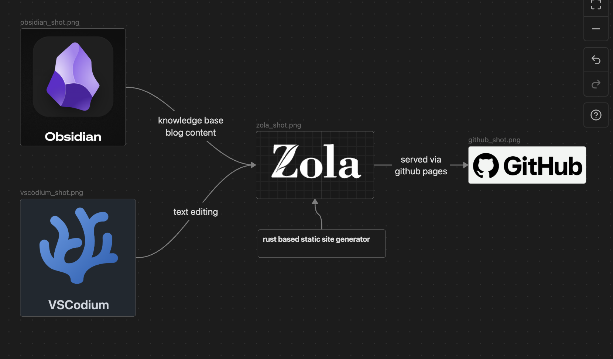
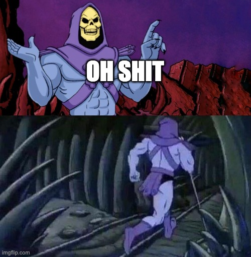

+++
title = "test"
date = 2019-11-27
[extra]
image = "wizard.jpeg"
+++

# pongus pingus hingus DINGUS

If you're reading this, we have done it. We have built both our apprentice grimoire (in this case a basic spellbook bound in human flesh) and a cute little content publishing pipeline to the world wide web "fo free". 

*edit:* ok mostly free

## <why?>

Listen I don't have to justify anything.

## <how?>

- Obsidian      - knowledge management, diagram creation, etc. our work horse
- Vscodium      - or whatever text editor you want to. it truly doesn't matter
- Zola          - rust based static site generator (ssg). converts markdown files to html
- Github Pages  - hosts our zola ssg instance

 

 

## <huh?>

### [obsidian](https://obsidian.md/)

This could honestly have been just a post about my fanboi'ism toward Obsidian and, if I wasn't an over controlling cheap bastard, it would be because of [Publish](https://obsidian.md/publish). <h1 class="glitch" data-text="OH LORD I'M LICKIN MY CHOPS THANKIN ABOUT IT NOW">OH LORD I'M LICKIN MY CHOPS THANKIN ABOUT IT NOW</h1>

Lets talk about it.

Features

- personal knowledge base
- diagram building
- publish (with paid sub)
- limitless with plugins

This tool is a markdown file editor, a personal knowledge base manager, and a billion other things when you dive into Core / Community plugins. It utilizes "vaults" to logically seperate knowledge repos and from there you can structure your layout however you would like.

I'm using it to warehouse, structure, and organize research for my next project. I'm also using it just for all of the horse shit I have to do around the house because I don't want to have to remember or re-youtube my way through problems. Its alot of upfront work but the reward is having a second brain.

You can pay for device sync, but were broke, so were syncing to github. Do that however makes sense to you.

Also diagrams with [canvas](https://obsidian.md/help/plugins/canvas) are a limited but useful feature.

A few recommendations:

- Decide a folder structure, use it throughout your vault, and maintain it (its our workspace, don't make a fucking mess)
- Community plugins can be seemingly great additions but vetting is required
- Don't spend half your afternoon screwing off with themes, default and go

### [vscodium](https://vscodium.com/)

This is just a text editor (vscode without the michaelsoft). Use whatever you enjoy. I'm treading lightly here because I don't want some vim warlord to tell me about their royal bloodline of data processors back in the day.

- vet and install whatever LSP's you need
- don't get too crazy with extensions 
- I try to keep my configuration settings in everything as close to default as possible and adjust as needed

### [zola](https://www.getzola.org/)

Everytime I read the word "zola" I think of that terrifying giant green head from Power Rangers:

This is a rust based [static site generator](https://en.wikipedia.org/wiki/Static_site_generator). I am using it because I've taken a dive into rust programming and figured why not? I am sure other options such as [Jeckyl](https://jekyllrb.com/), [Hugo](https://gohugo.io/), etc are great and I've lightly explored most, this one just keeps me all in on rust.

It was also the first SSG where I didn't entertain trying to pick a theme and then customizing that theme. I've found the best approach is to just walk through the [documentation](https://www.getzola.org/documentation/getting-started/overview/) (shocker) and tinker to your hearts content. 

The idea here is that you put in the upfront work of customizing your website with html templates and scss styling, and after that its just writing content in markdown format per post. Zola handles everything else for you. Because this is a static site, were not mucking with a web app, everything is minimal, and no real attack surface for "lookie lou's" to dig into.

Some quick tips:

- the majority of the work comes from building out your html [templates](https://www.getzola.org/documentation/templates/overview/) and content
- there is flexibility in how you structure and organize your site, you do need to account for how zola slaps it all together though
- `zola serve` is your friend for local testing / debugging
- zola uses [sass](https://sass-lang.com/) css. You can learn it and roll your own or let AI take the wheel and lash out at it attempting to deliver you the most generic bullshit ever. Just make a .bak of whatever you have before letting the machine take over
- if you're completely lost, feel free to use my [site](https://github.com/witherrors/witherrors.github.io/tree/main) as a point of reference

Is it better than using something dedicated to blogging that is offered as a SaaS solution (like [medium](https://medium.com/))? No clue. It took me around a week (off-time) to figure out everything going on and tweak things in zola to land 
at a "this is acceptable" point. I like the control, I love the price (free), and I think its the right approach for somebody trying to detangle from subscriptions.

<h1 class="glitch" data-text="LETS KEEP IT MOVING DIPSHIT">LETS KEEP IT MOVING DIPSHIT</h1>

### [github pages](https://docs.github.com/en/pages)

Were using github pages to host our static site content and a workflow that runs everytime I do a `git push` to the main branch. Zola has documentation for this [here](https://www.getzola.org/documentation/deployment/github-pages/). I don't want to get too crazy on this section because the options are limitless here. You can take a look at my workflow [here](https://github.com/witherrors/witherrors.github.io/blob/main/.github/workflows/deploy.yml), it is minimal and works for me. You do you boo boo.

# GRIMOIRE RECAP

Ok. So we have a knowledge base that were building out with obsidian & vscodium. As we perform research, have findings, and arrive at things we want to communicate to the world, we carve that information out of our dank grimoire and push it into our magical blog pipeline which right now consists of zola & github pages.

And what are we researching?

---------------------------------------------------------------------------

Tyler close us out:

  <iframe style="position: absolute; top: 0; left: 0; width: 100%; height: 100%;" 
    src="https://www.youtube.com/embed/HS1OUFCfFdY"
    title="YouTube video player" 
    frameborder="0" 
    allow="accelerometer; autoplay; clipboard-write; encrypted-media; gyroscope; picture-in-picture; web-share" 
    referrerpolicy="strict-origin-when-cross-origin" 
    allowfullscreen>
  </iframe>

